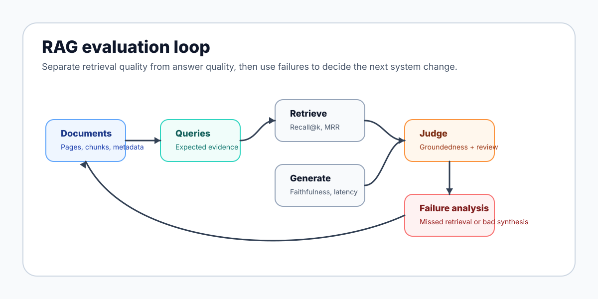

# RAG Evaluation Notes

"It answers well" is not enough to evaluate a RAG system. A generated answer can sound fluent while being unsupported, incomplete, slow, expensive, or retrieved from the wrong document.

## Retrieval Quality vs Generation Quality

Retrieval quality asks whether the system found the right evidence. Generation quality asks whether the model used that evidence correctly.

A bad answer can come from either side:

- The retriever missed the relevant page.
- The retriever found the page, but the generator ignored it.
- The generator answered from prior knowledge instead of grounded context.
- The answer is technically correct but too slow or too expensive.

## Metrics

Recall@k measures whether the relevant document or passage appears in the top `k` retrieved results.

MRR, or mean reciprocal rank, rewards systems that rank the first relevant result higher.

Groundedness checks whether claims in the answer are supported by retrieved evidence.

Answer faithfulness checks whether the generated answer stays faithful to the provided context instead of adding unsupported claims.

Latency measures how long retrieval and generation take.

Cost measures embedding, storage, retrieval, reranking, and generation expense.

Document coverage checks whether the evaluation set covers the kinds of documents the system is expected to handle.

## Failure Analysis

Useful evaluation includes failure categories:

- Missed retrieval.
- Wrong page or wrong chunk.
- Correct retrieval but weak synthesis.
- Unsupported answer claim.
- Table or chart misunderstanding.
- Layout-order error.
- Slow query path.
- High cost for low-value query.

Failure analysis is where evaluation becomes useful for product work. It points to the next engineering change.

## Evaluation Datasets

Good evaluation sets should include real document shapes:

- Clean text PDFs.
- Scanned PDFs.
- Tables.
- Forms.
- Charts.
- Mixed-script or multilingual pages.
- Long documents where the answer is buried.

Each item should include the query, expected answer, supporting evidence, and notes about acceptable variation.

## Human Review Loops

Human review is still important. Reviewers can judge whether evidence is sufficient, whether the answer is useful, and whether the system is failing in ways the metrics miss.

For document AI, the review loop should capture both retrieval failures and answer failures. Otherwise the team may tune the wrong layer.
